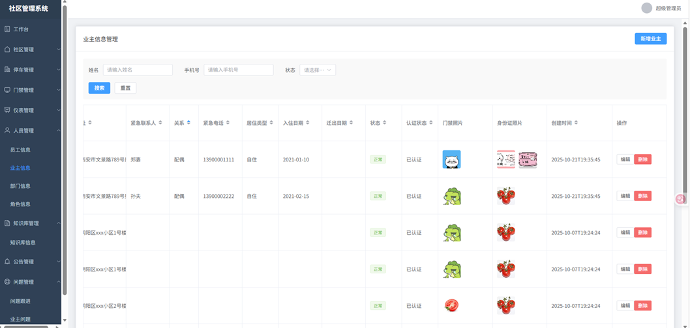
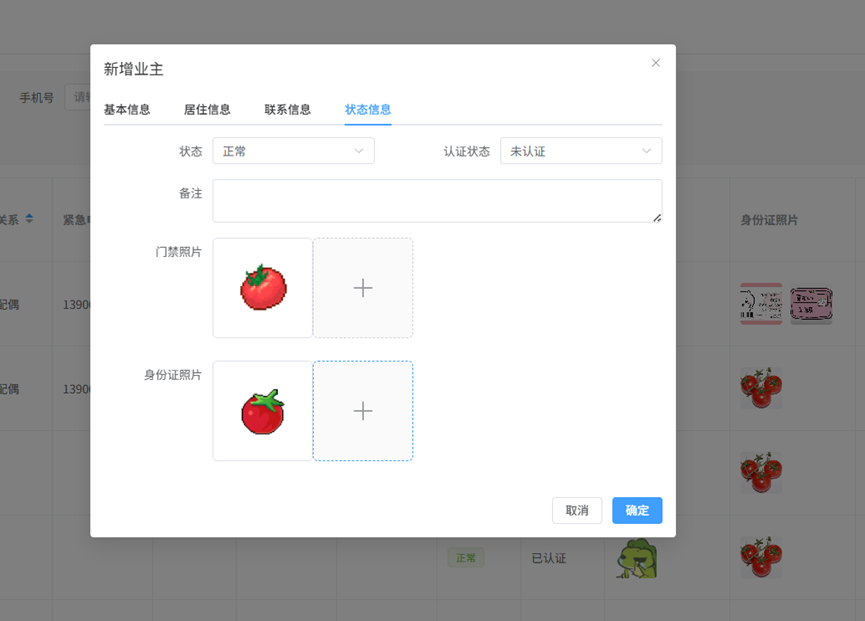
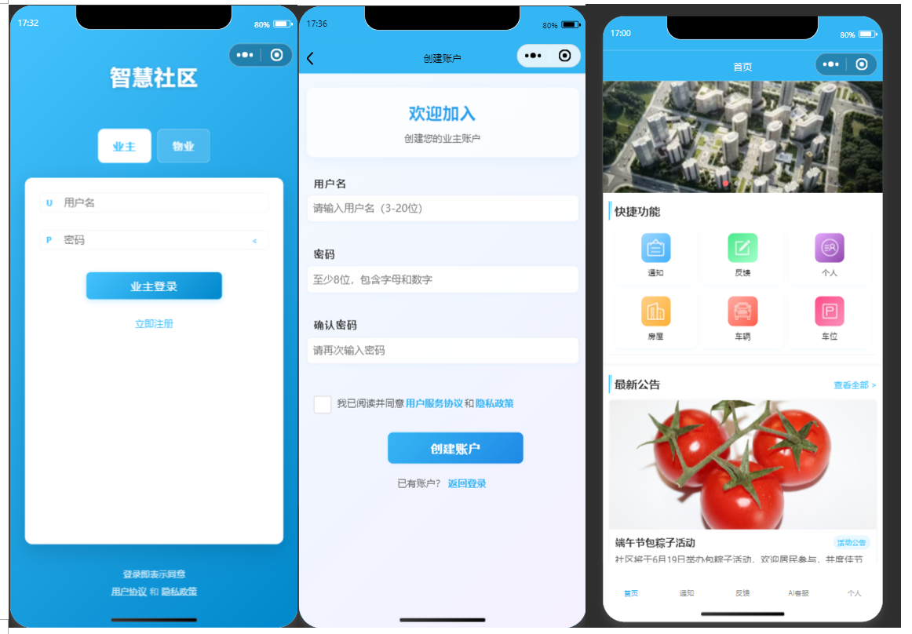
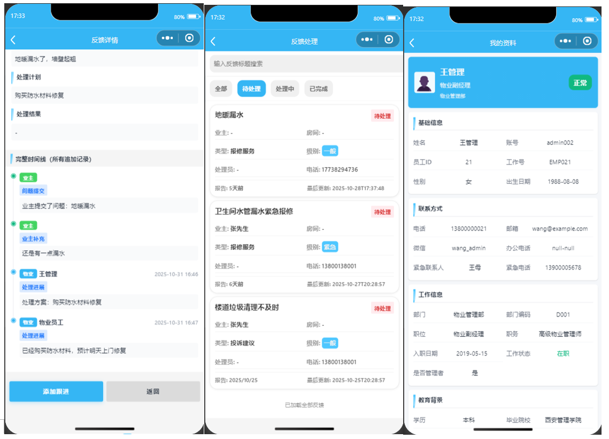
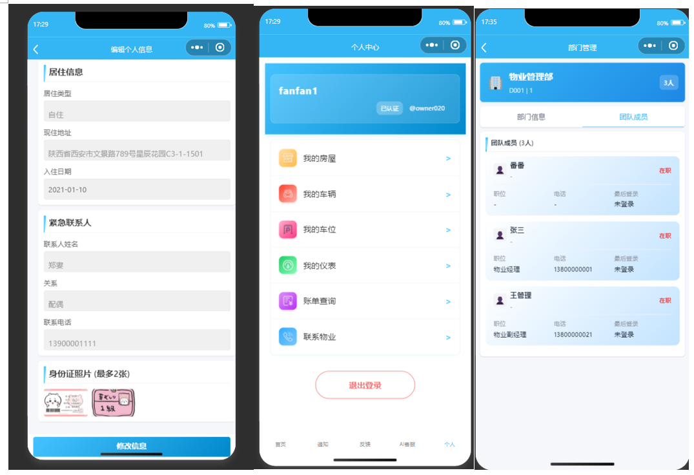

#  社区数字化管理平台 - 项目总体说明

 

##  项目概述

**社区数字化管理平台**是一套完整的智慧社区解决方案，采用前后端分离的微服务架构设计。该平台为社区管理部门和业主提供了涵盖住户管理、房屋管理、车辆管理、停车管理、门禁管理、表计管理等核心功能的现代化数字管理与服务平台。

该项目由四个主要模块组成，分别针对**管理员（后端和前端）**和**业主/物业（后端和前端）**三个角色的业务需求。

---

## 项目指路

管理员前端-web网页（vue3+elementplus）：https://github.com/K-iitty/CommunitySystemFrontend

管理员后端（springboot3）：https://github.com/K-iitty/CommunitySystemBackend

业主/物业前端-微信小程序（微信小程序原生）：https://github.com/K-iitty/CommunityClientFrontend

业主/物业后端（springboot3）：https://github.com/K-iitty/CommunityClientBackend

---

##  项目模块结构与联系

### 项目组成

| 项目名称 | 技术栈 | 端口 | 用途 | 说明 |
|---------|-------|------|------|------|
| **CommunitySystem-Backend** | Spring Boot 3.3.4 | 8080 | 管理员后端 | 核心系统管理，完整的业务功能实现 |
| **CommunityClient-Backend** | Spring Boot 3.3.4 | 8081/8082 | 业主物业后端 | 业主和物业两个端口的独立服务 |
| **管理员前端** | Vue 3 + Element Plus | 5173 | 管理员管理界面 | Web管理系统，用于社区和物业管理 |
| **业主物业小程序** | 微信小程序原生框架 | - | 移动端应用 | 双角色小程序（业主和物业) |

### 模块间的联系与数据流

```
┌─────────────────────┐                    ┌──────────────────────┐
│  管理员Web前端        │                    │  业主物业小程序        │
│  (Vue 3 + Vite)     │                    │  (微信小程序原生)      │
└──────────┬──────────┘                    └──────────┬───────────┘
           │                                          │
           │ HTTP/HTTPS                              │ HTTP/HTTPS
           │ REST API                                │ REST API
           │                                          │
    ┌──────▼──────────────────┐           ┌──────────▼─────────┐
    │ CommunitySystem-Backend │           │ CommunityClient    │
    │ (Spring Boot 8080)      │           │ Backend            │
    │ - 系统管理               │           │ (Spring Boot)      │
    │ - 社区管理               │           │ - 业主端 (8081)     │
    │ - 数据统计               │           │ - 物业端 (8082)     │
    │ - 权限控制               │           │                    │
    └──────┬──────────────────┘           └──────────┬─────────┘
           │                                         │
           └──────────────┬──────────────────────────┘
                          │
                    共享同一数据库
                    (MySQL + Redis)
                          │
                    ┌─────▼────────┐
                    │  数据层       │
                    │ MySQL 8.0    │
                    │ Redis Cache  │
                    └──────────────┘
```

### 模块间的区别

| 特性 | 管理员系统 | 业主物业系统 |
|------|----------|-----------|
| **前端** | Web管理界面（Vue 3） | 移动小程序 |
| **主要用户** | 社区管理人员 | 业主和物业员工 |
| **核心功能** | 系统级管理和配置 | 业务级应用和查询 |
| **权限模型** | 基于角色的权限管理 | 业主和物业两种角色 |
| **业务端口** | 8080 | 8081(业主)/8082(物业) |
| **UI体验** | PC管理系统风格 | 移动端小程序风格 |
| **数据覆盖** | 全部业务数据 | 部分业务数据（角色限制） |

---

## ✨ 技术亮点

### 🏗️ 架构设计

| 亮点 | 说明 | 技术实现 |
|-----|------|--------|
| **微服务架构** | 后端分为管理端和客户端两个独立微服务，可独立部署、扩展 | Spring Boot + 独立的微服务模块 |
| **模块化设计** | 业主模块和物业模块完全独立，业务逻辑清晰 | 项目结构的包/模块划分 |
| **分层架构** | 标准的MVC三层架构（Controller→Service→DAO） | Spring Framework标准分层 |
| **前后端分离** | 完全的前后端分离，支持多种前端形态（Web/小程序） | RESTful API设计 |
| **高性能缓存** | 集成Redis缓存，提升系统性能 | Redis数据库 + Spring Cache |

### 🔐 安全机制

| 安全特性 | 说明 | 实现方式 |
|--------|------|--------|
| **JWT认证** | 无状态token认证，支持多端登录 | JJWT库 + 自定义JWT过滤器 |
| **权限控制** | 基于角色的访问控制(RBAC) | Spring Security + 权限验证 |
| **操作审计** | 完整的管理员操作日志记录 | AOP实现的操作日志切面 |
| **密码加密** | 密码安全存储和验证 | Spring Security密码编码 |
| **CORS配置** | 跨域资源共享安全配置 | 自定义WebMvcConfig |

### 📡 API与集成

| 特性 | 说明 | 技术选型 |
|-----|------|--------|
| **API文档自动生成** | 使用Knife4j和SpringDoc生成交互式API文档 | Knife4j 4.4.0 + SpringDoc OpenAPI 2.6.0 |
| **在线测试** | 可直接在文档中测试API接口 | Knife4j文档UI |
| **OpenAPI 3.0规范** | 符合行业标准的API规范 | SpringDoc OpenAPI实现 |
| **AI集成** | 集成阿里云通义千问大模型，提供智能问答 | Spring AI Alibaba + LangChain4j |
| **文件存储** | 支持阿里云OSS对象存储 | Aliyun OSS SDK 3.17.4 |

### 💾 数据与ORM

| 特性 | 说明 | 技术实现 |
|-----|------|--------|
| **MyBatis Plus** | 强大的ORM框架，简化数据库操作 | MyBatis Plus 3.5.6 |
| **高性能连接池** | HikariCP连接池管理 | HikariCP Latest |
| **事务管理** | 自动事务管理，确保数据一致性 | Spring @Transactional |
| **数据验证** | 参数合法性验证 | 自定义验证工具 |
| **复杂查询** | 支持多表关联和复杂查询 | MyBatis Plus QueryWrapper |

### 🔄 响应式编程

| 特性 | 说明 | 用途 |
|-----|------|------|
| **WebFlux** | Spring WebFlux异步流式处理 | 提高系统并发能力 |
| **异步处理** | 支持异步业务处理 | 高并发场景优化 |

### 📱 前端技术亮点

| 特性 | 说明 | 实现 |
|-----|------|------|
| **Vue 3 Composition API** | 最新的Vue 3组合式API | 管理员前端 |
| **响应式设计** | 完全的响应式小程序 | 业主物业小程序 |
| **智能路由** | 动态路由配置，支持权限级路由 | Vue Router |
| **状态管理** | 全局状态管理 | App.js/Pinia等 |
| **UI组件库** | 专业的UI组件库 | Element Plus/微信UI |

---

## 🎯 核心功能特点

### 管理员系统 (CommunitySystem-Backend)

**核心功能模块**:
- ✅ **系统管理** - 管理员、角色、权限管理
- ✅ **社区管理** - 社区信息、楼栋、房屋管理
- ✅ **业主管理** - 业主档案、认证、权限
- ✅ **员工管理** - 员工信息、部门、权限
- ✅ **车辆管理** - 车辆注册、驾照认证、违规记录
- ✅ **停车管理** - 停车场、停车位、停车记录、预订
- ✅ **门禁管理** - 门禁设备、记录、出入统计
- ✅ **表计管理** - 表计配置、读数、缴费记录
- ✅ **公告通知** - 公告发布、分类、历史管理
- ✅ **报事处理** - 业主报事、工单跟进、完成统计
- ✅ **知识库** - 知识库维护、AI问答功能
- ✅ **操作审计** - 管理员操作日志、行为追踪

### 业主物业系统 (CommunityClient-Backend)

**业主端功能**:
- ✅ 首页快捷操作、通知预览
- ✅ 公告查看和评价
- ✅ 问题反馈和追踪
- ✅ 个人中心（信息编辑）
- ✅ 房产管理（查看、编辑）
- ✅ 车位管理（添加、编辑）
- ✅ 水电表查询和提交
- ✅ 账单查询
- ✅ AI智能客服
- ✅ 物业联系信息

**物业端功能**:
- ✅ 数据统计首页
- ✅ 反馈管理和处理
- ✅ 房产信息维护
- ✅ 车位管理
- ✅ 表读数管理
- ✅ 公告发布和管理
- ✅ 部门人员管理
- ✅ 社区信息维护

### 小程序前端 (业主物业双端小程序)

**技术特点**:
- ✅ 双角色架构（业主和物业）
- ✅ 完整的业主和物业功能
- ✅ 20+业主端页面，27+物业端页面
- ✅ 智能登录状态管理
- ✅ 统一的API调用封装
- ✅ 蓝色主题统一设计

### Web管理前端 (管理员系统前端)

**技术特点**:
- ✅ Vue 3 + Composition API
- ✅ Element Plus组件库
- ✅ 完整的权限控制
- ✅ RESTful API集成
- ✅ 数据表格、表单、图表等

---

## 🛠️ 技术要点

### 后端核心技术栈

| 类别 | 技术 | 版本 | 用途 |
|------|------|------|------|
| **框架** | Spring Boot | 3.3.4 | 核心应用框架 |
| **语言** | Java | 17 | 开发语言 |
| **ORM** | MyBatis Plus | 3.5.6 | 数据库操作 |
| **安全** | Spring Security | Latest | 安全认证 |
| **认证** | JJWT | 0.11.5 | Token管理 |
| **数据库** | MySQL | 8.0 | 关系型数据库 |
| **缓存** | Redis | Latest | 性能优化 |
| **文档** | Knife4j | 4.4.0 | API文档 |
| **文档** | SpringDoc OpenAPI | 2.6.0 | OpenAPI规范 |
| **存储** | Aliyun OSS | 3.17.4 | 对象存储 |
| **AI集成** | Spring AI Alibaba | 1.0.0-M6.1 | 大模型集成 |
| **AI框架** | LangChain4j | 1.4.0 | AI框架 |
| **文档处理** | Apache POI | 5.2.3 | Word/Excel处理 |
| **PDF处理** | Apache PDFBox | 2.0.28 | PDF处理 |
| **连接池** | HikariCP | Latest | 数据库连接 |

### 前端核心技术栈

**Web管理系统**:
- Vue 3 (Composition API)
- Vue Router (路由管理)
- Element Plus (UI组件库)
- Axios (HTTP客户端)
- Vite (构建工具)

**微信小程序**:
- 微信官方框架 (v3.8.10+)
- JavaScript (ES6+)
- WXML (模板引擎)
- WXSS (样式)
- wx.request (HTTP客户端)
- 本地存储 (wx.setStorageSync)

---

## 功能展示














##  核心依赖清单

### 后端依赖

```xml
<!-- Spring Boot框架 -->
<dependency>
    <groupId>org.springframework.boot</groupId>
    <artifactId>spring-boot-starter-web</artifactId>
    <version>3.3.4</version>
</dependency>

<!-- 安全认证 -->
<dependency>
    <groupId>org.springframework.boot</groupId>
    <artifactId>spring-boot-starter-security</artifactId>
</dependency>

<!-- JWT -->
<dependency>
    <groupId>io.jsonwebtoken</groupId>
    <artifactId>jjwt</artifactId>
    <version>0.11.5</version>
</dependency>

<!-- ORM框架 -->
<dependency>
    <groupId>com.baomidou</groupId>
    <artifactId>mybatis-plus-boot-starter</artifactId>
    <version>3.5.6</version>
</dependency>

<!-- MySQL驱动 -->
<dependency>
    <groupId>mysql</groupId>
    <artifactId>mysql-connector-java</artifactId>
    <version>8.0.32</version>
</dependency>

<!-- Redis -->
<dependency>
    <groupId>org.springframework.boot</groupId>
    <artifactId>spring-boot-starter-data-redis</artifactId>
</dependency>

<!-- API文档 -->
<dependency>
    <groupId>com.github.xiaoymin</groupId>
    <artifactId>knife4j-openapi3-spring-boot-starter</artifactId>
    <version>4.4.0</version>
</dependency>

<dependency>
    <groupId>org.springdoc</groupId>
    <artifactId>springdoc-openapi-starter-webmvc-ui</artifactId>
    <version>2.6.0</version>
</dependency>

<!-- 阿里云OSS -->
<dependency>
    <groupId>com.aliyun.oss</groupId>
    <artifactId>aliyun-sdk-oss</artifactId>
    <version>3.17.4</version>
</dependency>

<!-- AI集成 -->
<dependency>
    <groupId>com.alibaba.cloud</groupId>
    <artifactId>spring-cloud-alibaba-dependencies</artifactId>
    <version>1.0.0-M6.1</version>
</dependency>

<dependency>
    <groupId>dev.langchain4j</groupId>
    <artifactId>langchain4j-core</artifactId>
    <version>1.4.0</version>
</dependency>

<!-- Lombok -->
<dependency>
    <groupId>org.projectlombok</groupId>
    <artifactId>lombok</artifactId>
    <version>1.18.30</version>
</dependency>

<!-- 文档处理 -->
<dependency>
    <groupId>org.apache.poi</groupId>
    <artifactId>poi</artifactId>
    <version>5.2.3</version>
</dependency>

<dependency>
    <groupId>org.apache.pdfbox</groupId>
    <artifactId>pdfbox</artifactId>
    <version>2.0.28</version>
</dependency>
```

---

## 📝 功能特点总结

### 集成化功能

| 功能 | 说明 | 受益人 |
|-----|------|-------|
| **智能问答系统** | 集成大模型，AI驱动的智能客服 | 业主、物业、管理员 |
| **文件管理** | 支持多种格式（PDF、Word等）处理和上传 | 全部用户 |
| **数据统计** | 完整的数据分析和统计功能 | 管理员、物业 |
| **权限管理** | 细粒度的权限控制 | 管理员 |
| **审计日志** | 完整的操作追踪记录 | 管理员 |
| **多端支持** | Web、小程序等多种客户端支持 | 全部用户 |
| **云存储** | 阿里云OSS集成 | 全部用户 |
| **缓存优化** | Redis缓存提升性能 | 系统整体 |
| **异步处理** | 支持高并发场景 | 系统整体 |

### 用户端功能

| 用户类型 | 核心功能 | 优势 |
|--------|--------|------|
| **业主** | 通知、反馈、查询、智能客服 | 便捷的社区服务体验 |
| **物业** | 管理、处理、维护、统计 | 高效的物业管理工具 |
| **管理员** | 配置、权限、审计、分析 | 完整的系统控制能力 |

---

## 🚀 快速开始

### 环境要求

- **Java 17** 或更高版本
- **Node.js** 14+ (前端构建)
- **Maven 3.6+** (后端构建)
- **MySQL 8.0+** (数据库)
- **Redis 6.0+** (缓存)
- **微信开发者工具** (小程序开发)

### 后端启动

```bash
# 1. 克隆项目
git clone <repository-url>

# 2. 创建数据库
mysql -u root -p
CREATE DATABASE community CHARACTER SET utf8mb4 COLLATE utf8mb4_unicode_ci;

# 3. 导入SQL脚本
# 未提供

# 4. 修改配置文件 application.yml
# 配置数据库、Redis、JWT、OSS等

# 5. 构建项目
mvn clean install

# 6. 运行管理员后端
mvn -pl CommunitySystem-Backend spring-boot:run
# 访问: http://localhost:8080/doc.html

# 7. 运行业主物业后端
mvn -pl CommunityClient-Backend spring-boot:run
# 业主端: http://localhost:8081
# 物业端: http://localhost:8082
```

### 前端启动

**Web管理系统**:
```bash
# 1. 进入前端目录
cd 管理员前端

# 2. 安装依赖
npm install

# 3. 开发环境运行
npm run dev

# 4. 构建生产版本
npm run build

# 访问: http://localhost:5173
```

**小程序**:
```bash
# 1. 使用微信开发者工具打开项目
# 2. 点击编译按钮 (Ctrl+B 或 Cmd+B)
# 3. 在模拟器中预览和调试
# 4. 修改代码后自动刷新

# 关键配置: CommunitySystemClient/app.js
# baseUrl: http://localhost:8080 (根据角色自动切换8081或8082)
```

---

## 📚 技术支持与参考文档

### API文档

启动后端服务后，可访问以下地址：

- **Knife4j文档** (推荐): `http://localhost:8080/doc.html`
- **Swagger UI**: `http://localhost:8080/swagger-ui.html`
- **OpenAPI JSON**: `http://localhost:8080/v3/api-docs`

### 项目文档

项目包含详细的文档，包括：
- 快速开始指南
- 开发规范文档
- API接口详细说明
- 数据库设计文档
- 部署指南
- 优化指南

### 相关技术文档

- [Spring Boot官方文档](https://spring.io/projects/spring-boot)
- [MyBatis Plus文档](https://baomidou.com/)
- [Vue 3官方文档](https://v3.vuejs.org/)
- [Element Plus文档](https://element-plus.org/)
- [微信小程序官方文档](https://developers.weixin.qq.com/miniprogram/dev/)
- [Knife4j文档](https://doc.xiaomingsoft.cn/knife4j/)

---

## 🔧 配置说明

### 核心配置文件

**后端配置** (`application.yml`):
```yaml
spring:
  application:
    name: community-system
  datasource:
    url: jdbc:mysql://localhost:3306/community
    username: root
    password: your_password
  data:
    redis:
      host: localhost
      port: 6379

server:
  port: 8080  # 管理员系统
  # 或 8081 (业主端) / 8082 (物业端)

jwt:
  secret: your_secret_key
  expiration: 86400000

aliyun:
  oss:
    endpoint: oss-cn-beijing.aliyuncs.com
    bucket-name: your-bucket
```

**前端配置** (Vue):
- `vite.config.js` - Vite构建配置
- `.env` - 环境变量配置

**小程序配置** (微信):
- `project.config.json` - 微信开发者工具配置
- `app.js` - 应用全局配置

---

## 💡 项目亮点

### 1. **完整的业务生态**
覆盖社区管理的全业务链条，从系统管理到业主服务，一个平台搞定。

### 2. **现代化技术栈**
采用最新的Spring Boot 3.x、Vue 3等主流技术，确保项目的先进性和可维护性。

### 3. **双端支持**
同时支持Web管理系统和微信小程序，满足不同场景的需求。

### 4. **AI集成**
内置大模型集成，提供智能问答能力，提升用户体验。

### 5. **安全可靠**
完善的JWT认证、权限控制、操作审计，确保系统安全。

### 6. **高性能架构**
Redis缓存、连接池、异步处理等多重优化，支持高并发。

### 7. **详细文档**
API自动化文档、开发指南、部署说明等，降低学习成本。

### 8. **易于扩展**
模块化设计，清晰的分层架构，方便功能扩展和维护。

---

## 📊 项目统计

| 指标 | 数值 |
|------|------|
| **后端服务** | 2个独立微服务 |
| **前端应用** | 2个（Web + 小程序） |
| **核心功能模块** | 14+ |
| **API接口** | 200+ |
| **数据库表** | 50+ |
| **小程序页面** | 47+ |
| **技术文档** | 70+ |
| **代码行数** | 50,000+ |

---

## 🤝 开发规范

### 命名规范

- **Java包名**: 小写英文 (如 `com.community.web.controller`)
- **类名**: 大驼峰 (如 `OwnerController`)
- **方法名**: 小驼峰 (如 `getOwnerById`)
- **常量**: 大写下划线 (如 `MAX_PAGE_SIZE`)
- **前端变量**: 小驼峰 (如 `userName`)

### 提交规范

```
feat: 新功能
fix: Bug修复
docs: 文档更新
style: 代码风格
refactor: 代码重构
perf: 性能优化
test: 测试代码
chore: 其他更改

示例: feat: 添加业主反馈功能
```

### 代码风格

- **缩进**: 4个空格（Java），2个空格（JavaScript）
- **行长**: 尽量不超过120个字符
- **注释**: 清晰的中英文注释
- **文档**: 类和公开方法需要文档说明

---

## 📞 联系与支持

- **项目维护**: https://github.com/K-iitty
- **问题反馈**: 提交Issue或17783913741@163.com
- **技术支持**: 查看项目文档或提交讨论

---

## 📄 许可证

本项目采用 MIT 许可证。

---

**最后更新**: 2025年11月  
**项目版本**: 1.0.0  
**维护团队**: https://github.com/K-iitty
